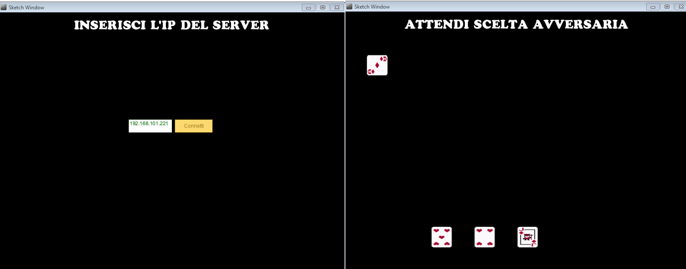

# Briscola in Java

A client/server app to play Briscola.

## Requirements

To run and build the code, you will need to have the following software installed:

- Processing 3 or later: Download and install Processing from the official website https://processing.org/download/.

## How to Run

To run the game, follow these steps:

1. Download the source code from the project's GitHub repository
2. Open the `briscolaServer02.pde` file in Processing.
3. Click the "Run" button in the Processing IDE.
4. The server will start running.
4. Run two separate instance of `briscolaClient01.pde` and connect to the server to start a game

## How to Install Missing Libraries

If the game fails to run due to missing libraries, you can install them by following these steps:

1. Open the Processing IDE.
2. Click the "Sketch" menu and select "Import Library".
3. Search for the missing library in the "Libraries" tab.
4. Click the "Install" button next to the library.
5. The library will be installed and you can now run the game.

## Contributing

This project was created just for fun and experimenting with Processing, but if you want to contribute to it, feel free to fork the repository and make your changes. You can then submit a pull request with your changes for review.

## License

This project is licensed under the MIT License - see the `LICENSE` file for details.
